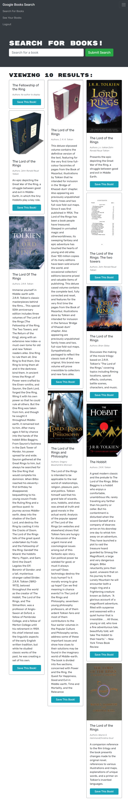

# mern-book-search-engine

## description

This project is a MERN stack book-search enginge with login and sign up features for users to be able to save books for later. This uses a graphql API built with the apollo server and a react frontend, mongoDB database, and node/express.js server. Users can search for books using the googlebooks API on the website, and can save and delete books from their account.

## screenshots

homepage screenshot:

book search screenshot:

saved books screenshot:

## links

here is the link to the repo [mern-book-search-engine/repo] (https://github.com/Jasonsburke90/mern-book-search-engine)

here is the link to the heroku app [mern-book-search-engine/heroku] (https://mern-book-search-app-jsb.herokuapp.com/)
